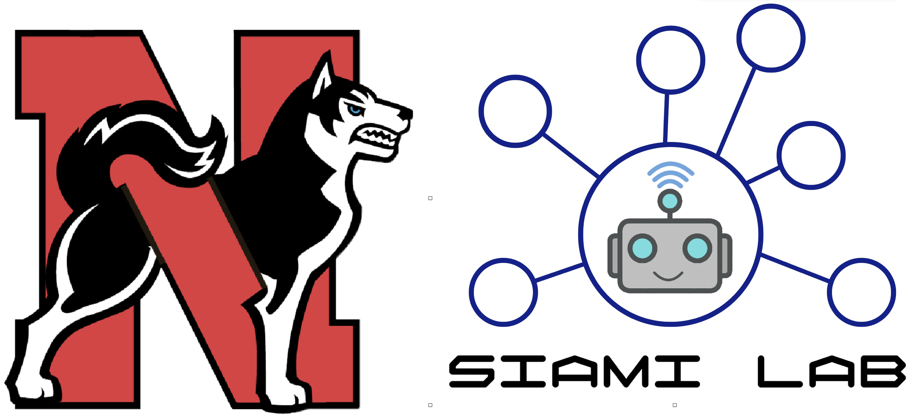

# Real-time Mapping using QCar


<p align="center">

</p>

<p  align="center"> <b>SiamiLab group's Framework for ACC 2023 Competitions <br> (SELF-DRIVING CAR COMPETITION)</b> </p>

</br>

## **Outline**
In this project, we propose a framework for the [QCar](https://www.quanser.com/products/qcar/) vehicles to perform SLAM in a scaled-down city, map the environment, and determine the absolute position of the objects of interest (specifically, traffic signs).

This framework has been developed by [SiamiLab](http://web.mit.edu/~siami/www/) and was awarded first place in the [ACC 2023](https://acc2023.a2c2.org/) Quanser Competition.

</br>

<p align="center">

</p>

</br>


### **You can find the video of this framework in our [youtube channel](https://youtu.be/f5NiJRkdWPw).**

</br>
</br>


## **Installation**

- **ROS2 Environment**
This framework has been tested and developed using ROS2 [Dashing](https://docs.ros.org/en/dashing/Installation.html) and [Foxy](https://docs.ros.org/en/foxy/Installation.html). Its better to use ROS2 Foxy if you are using [QLabs Virtual QCar](https://www.quanser.com/products/qlabs-virtual-qcar/), and for the actual QCars you need to use ROS2 Dashing.

- **SLAM Toolbox**
The framework uses [slam-toolbox](https://github.com/SteveMacenski/slam_toolbox). you need to install it first with the instruction given in the provided link.

- **colcon tool**
On Linux use
```sh
sudo apt install python3-colcon-common-extensions
```
On Windows use
```sh
pip3 install -U colcon-common-extensions # use pip instead of pip3 if needed
```

- **python Dependencies**
install the following packages
```sh
pip3 install pytransform3d # use pip instead of pip3 if needed
pip3 install scikit-image # use pip instead of pip3 if needed
```

- **Compiling The Framework**
	- download this projects either as a zip file of clone it using git.
	```sh
	git clone https://github.com/SiamiLab/QuanserCompetition.git
	```
	- go to the top level folder wehre the src folder exists and build the project using colcon
	```sh
	colcon build
	```

- **Yolo-v4**
	- You need to compile yolo-v4 on your system using GPU (with CUDA and CUDNN). [medium](https://medium.com/geekculture/yolov4-darknet-installation-and-usage-on-your-system-windows-linux-8dec2cea6e81) offers a good explanation of how to do it.

        **Note.** when you are changing the parameters in *Makefile* change `LIBSO=1` to create the .so library. Finally place the generated `libdarknet.so` in the following path of the framework.
        ```sh
        QuanserCompetition/src/pack_yolo/resource/
        ```
    - You also need the trained yolo weights, you can use [these weights](https://drive.google.com/file/d/168ieC-Gqteonv3FP_uIKq_198HfdNiy2/view?usp=sharing) and place the weight files in the following path of the framework.
        ```sh
        QuanserCompetition/src/pack_yolo/resource/
        ```

## **Running the Framework**
Our Framework offers the following packages and nodes:
- **pack_qcar**
	- **qcar_node** send commands to the wheels of the QCar and publishes IMU and linear velocity of the car. (The base of this node is provided by Quanser)
	- **lidar_node** comminicates to the RP Lidar on the QCar and publishes the Lidar data. (The base of this node is provided by Quanser)
	- **rgbd_node** communicates to the intel real-sense camera of the QCar and publishes the rgb and depth information. (The base of this node is provided by Quanser)
	- **gamepad_node** communicates to the LogitechF710 game controller and publishes user commands for the *qcar_node*. (This node is provided by Quanser)
	- **gps_node** connects to a GPS server on the localhost (if any?) and publishes the pose (position and orientation of the QCar).
	- **imgviewer_node** shows the RGB or DEPTH images comming from *rgbd_node*.
	- **odom_node** estimates the position of the QCar using the bicycle model and extended kalman filter, and corrects the estimation each time it receives a pose from *gps_node*.
	- **pose_node** calculates the final position of the QCar (base_footprint frame) with respect to the origin (map frame). (see the slam-toolbox link for more information of different frames)
	- **objectposition_node** calculates the position of each object of interest with respect to the origin (map)
	- **waypoint_node** drives the car autonomously through a set of pre defined points in the map using pure pursuit algorithm.
- **pack_yolo**
	- **yolo_node** detects the objects of interest using yolo and publishes the information.
- **pack_msgs**
	provides the needed custom ROS2 messages.
- **pack_util**
	provides the needed ROS2 params and launch files to run the nodes.

**Note.** The `qcar_node`, `lidar_node`, and `rgbd_node` nodes must be run on the QCar itself or the system running the *QLabs Virtual QCar*.

The final architecture and dependencies of our nodes is as follows.


<p align="center">

</p>

</br>

The final result of the frameworks should be like this. (use rviz2 to visualize).

<p align="center">

</p>

</br>
</br>


## **Optional setups**

</br>

### **Connecting The QCar to a wifi**
Use the following command to connect to a wifi for the first time.
```sh
nmcli dev wifi connect "wifi_ssid" password “wifi_password"
```
Use the following command to connect to a wifi after the first time.
```sh
nmcli c up id "wifi_ssid"
```

</br>

### **Fixing apt**
First, add the following key repository
```sh
curl http://repo.ros2.org/repos.key | sudo apt-key add -
```
Second, fix the datetime of the QCar. (you have to do it everytime you restart the QCar)
```sh
date -s “28 MAY 2023 17:02:55”
```

### **Install zsh and oh my zsh**
Its much easier to install zsh and oh my zsh.

### **Libraries** (required)
add the `pal` and `hal` libraries (provided by Quanser) to `~/Documents`.

### **Change zshrc**
Add the following lines to the begining of `~/.zshrc`
```sh
## begin
if [ $UID -ne 0 ]; then
    sudo -s fi
fi
## end
```

### **Change zshenv**
Add the following lines to the begining of `~/.zshenv`
```sh
## begin
source /opt/ros/dashing/setup.zsh
source ~/QuanserCompetition/install/setup.zsh
export PYTHONPATH=$PYTHONPATH:~/Documents/python
## end
```

### **Disable Password for the *nvidia* user**
Open `visudo`
```sh
sudo visudo
```
Then add the following to the end of the file
```sh
nvidia ALL=(ALL) NOPASSWD: ALL
```

### **oh my zsh Warnings**
If you get warnings related to oh my zsh, do the following:
```sh
chmod -R 755 /home/nvidia/.oh-my-zsh
chown -R root:root /home/nvidia/.oh-my-zsh
```

